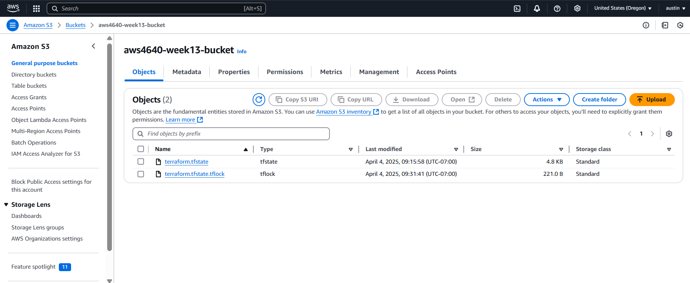

# 4640 Lab 13
---

## Members: Austin Park | Keziah Wacnang

### Questions:
* When is the state file created?
  * The state file is created after running `terraform apply` for the first time, and is stored in the S3 Bucket.

* When is the lock file present?
  * The lock file is present when you run a terraform command, for example `terraform plan`. Then the lock file will appear during the command, then disappears afterwards.

* Is the lock file always in the bucket after it is created?
  * No, the lock file only appears during terraform commands that interact with the state.

---

## Screenshot of the state file only:

## Screenshot that shows the lock file and the state file:
